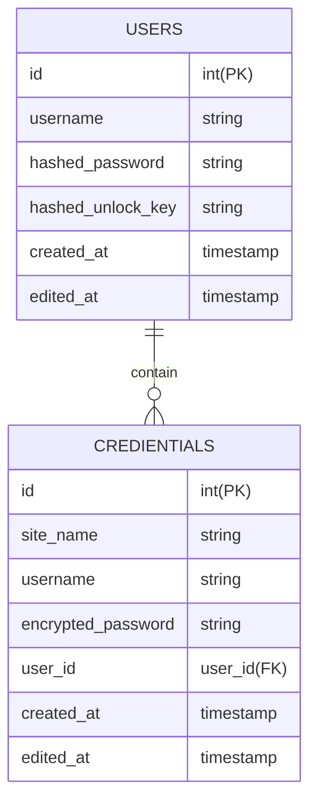

 # ER diagram

```mermaid
 erDiagram
 USERS ||--o{ CREDIENTIALS: contain
 USERS {
 id int(PK)
 username string
 hashed_password string
 hashed_unlock_key string
 created_at timestamp
 edited_at timestamp
 }

CREDIENTIALS{
id int(PK)
site_name string
username string
encrypted_password string
user_id user_id(FK)
created_at timestamp
edited_at timestamp
}
```
